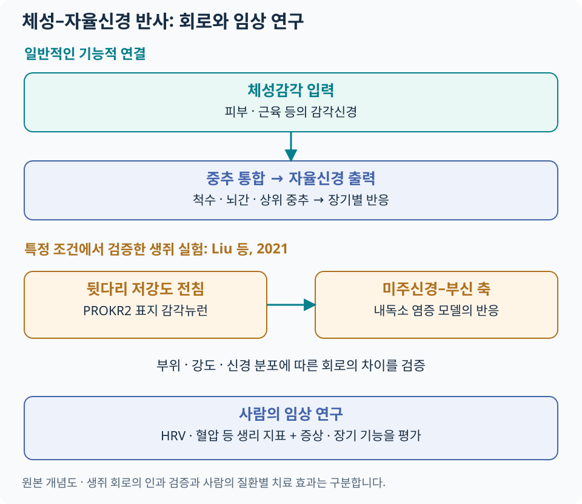

# 침과 자율신경계 {#_1}

자율신경계는 심박·혈압·위장관 운동·분비·체온조절 등 항상성 유지에 관여합니다. 침 연구에서는 **체성감각 입력(somatosensory input)이 중추 신경회로를 거쳐 자율신경 출력(autonomic output)에 영향을 주는 과정**을 탐색합니다.

## 기본 회로 {#_2}

피부·근육 등에서 들어온 감각 입력은 척수·뇌간과 상위 중추에서 통합됩니다. 자율신경 출력은 장기와 상황에 따라 달라지므로, ‘교감은 나쁘고 부교감은 좋다’는 구분보다 어떤 기능을 어떻게 조절했는지 보는 것이 유용합니다.

| 영역 | 회로를 읽는 관점 |
|---|---|
| 척수 | 체성 입력과 분절성 자율신경 반사의 연결 |
| 고립로핵(NTS)·배가쪽연수(VLM) | 내장 감각·심혈관 조절 등 뇌간 통합 |
| PAG·시상하부 | 방어·항상성·통증 관련 반응의 조절 |
| 섬엽·대상피질 | 내부 신체 상태·주의·정서와 자율신경 반응의 관계 |

이 영역들이 모든 자극에서 같은 순서로 작동하는 것은 아닙니다. 2022년 리뷰는 여러 감각·중추·자율신경 경로를 종합합니다. [Li 등, The autonomic nervous system, 2022](https://pubmed.ncbi.nlm.nih.gov/36570846/).

## Somato-autonomic reflex {#somato-autonomic-reflex}

[도해 크게 보기](../assets/acupuncture-science/autonomic.svg)

### 2021년 Nature 연구에서 확인한 범위 {#vagal-adrenal-study}

Liu 등의 연구는 **생쥐에서** 특정 전침 부위와 강도가 미주신경–부신 축을 작동시키는 신경해부학적 조건을 조사했습니다. 뒷다리 심부 근막 영역 등에 분포하는 PROKR2 표지 감각뉴런을 제거하거나 선택적으로 활성화하여 회로의 기여를 검증했습니다.

| 실험에서 확인한 내용 | 의미 |
|---|---|
| 뒷다리와 복부의 감각뉴런 분포 차이 | 자극 부위에 따라 접근하는 신경회로가 달라질 수 있음 |
| 특정 감각뉴런 제거 후 저강도 전침 반응 소실 | 해당 실험에서 미주신경–부신 반응에 그 뉴런 집단이 필요함을 지지 |
| 선택적 말단 활성화와 회로 반응 | 단순한 동시 변화보다 강한 회로 검증 근거 |
| 고강도 자극의 척수 교감신경 반사는 유지 | 강도·경로에 따른 반응을 구분할 필요 |

[원저: Liu 등, Nature 2021](https://pubmed.ncbi.nlm.nih.gov/34646018/). 연구는 내독소로 유발한 염증 모델을 포함하며, 사람의 염증성 질환 치료 효과나 용량을 직접 검증한 임상시험은 아닙니다. 다리의 체성감각 입력이 중추를 통해 연결되는 것이므로, 다리에 놓은 침이 미주신경을 직접 접촉한다는 뜻도 아닙니다.

## 임상 지표 {#_3}

사람 연구에서는 신경회로 전체를 직접 측정하기 어려워 심박·혈압·HRV·피부전도·피부온도와 장기 기능 등을 활용합니다. 측정 지표마다 생리적 의미와 영향을 받는 조건이 다릅니다.

### HRV는 무엇을 보여 주나요? {#hrv}

HRV(심박변이도)는 연속된 심장 박동 사이 간격의 변동을 분석합니다. 분석에 쓰는 정상 박동 간 간격을 NN 간격이라고 합니다. 시간·주파수 영역 지표의 기본 정의는 [ESC·NASPE 공동 측정 기준](https://www.ahajournals.org/doi/10.1161/01.cir.93.5.1043)을 따릅니다.

| 지표 | 의미 | 비교할 때 확인할 것 |
|---|---|---|
| SDNN | NN 간격의 표준편차 | 측정 길이와 전체 변동의 영향을 받으므로 같은 조건에서 비교 |
| RMSSD | 연속 NN 간격 차이를 이용한 시간영역 지표 | 호흡·심박수·기록 품질을 함께 확인 |
| HF | 고주파 대역의 변동 | 호흡과 심장 미주신경 조절의 영향을 함께 받음 |
| LF | 저주파 대역의 변동 | 여러 조절 요인이 섞여 있어 교감신경 활동으로 단순 치환하기 어려움 |
| LF/HF | 두 주파수 대역의 비 | 교감·부교감 ‘균형 점수’나 전신 자율신경 기능의 단일 판정값으로 사용하지 않음 |

특히 LF/HF는 호흡·심박수와 두 신경계의 복합적 상호작용에 영향을 받습니다. 이 한계를 정리한 [Billman의 생리학적 해설, 2013](https://www.frontiersin.org/journals/physiology/articles/10.3389/fphys.2013.00026/full)을 참고합니다.

### 사람 대상 HRV 연구 {#human-hrv-evidence}

2025년 메타분석은 **10개 RCT·744명**을 포함했습니다. SDNN의 개선을 보고했지만 LF·HF 결과에는 상당한 불확실성이 있었고, 대상 질환·치료 방식의 차이와 연구 방법의 한계가 남았습니다. 이 결과는 해당 조건에서의 심박변이도 변화로 읽고, 모든 장기의 자율신경 기능이 정상화되었다고 확대하지 않습니다. [Ma 등, 2025](https://pubmed.ncbi.nlm.nih.gov/41230507/).

태극침법을 대상으로 한 소양인·소음인·태음인의 소규모 교차 연구는 [태극침법 HRV 연구](../taegeuk-acupuncture/evidence.md#hrv)에 대상·비교군·결과를 정리했습니다. 소음인 연구의 전체 분석처럼 유의한 차이가 없었던 결과도 포함하여 체질별로 읽습니다.

### 반복 측정 조건 {#measurement-context}

HRV를 추적할 때에는 같은 자세·안정 시간·기록 길이를 유지하고 호흡, 심박수, 부정맥·신호 잡음을 확인합니다. 측정 시간대, 직전 활동·카페인, 복용약 등도 기록해 비교 가능성을 높입니다. 짧은 웨어러블 기록과 장시간 심전도 결과는 같은 기준으로 비교하지 않습니다.

## 증상·장기 기능에 연결하기 {#clinical-outcomes}

| 진료 질문 | 환자에게 중요한 결과 | 이어 볼 자료 |
|---|---|---|
| 잠들기 어렵거나 자주 깨는가? | 수면 시작·중간 각성·낮 기능 | [불면](../conditions/insomnia.md) |
| 식후 불편감·조기 포만이 있는가? | 증상 빈도·강도, 식사와 생활의 변화 | [기능성소화불량](../conditions/functional-dyspepsia.md) |
| 배변이 어렵고 잔변감이 있는가? | 완전자발배변·힘주기·삶의 질 | [전침 변비 임상시험](../authority/electroacupuncture.md#ea-constipation-trial) |
| 두근거림·어지럼 등 복합 증상이 있는가? | 증상 시점, 자세와의 관계, 객관적 활력징후 | [자율신경 기능 이상 안내](../autonomic/index.md) |

임상시험에서 장기 기능이 개선되었다는 결과와 그 변화가 특정 미주신경 회로로 생겼다는 결론은 별도의 질문입니다. 연구를 연결할 때에는 **증상·기능 결과를 먼저 확인하고, 생리 지표를 해석의 보조 자료로 사용**합니다.

치료 중 식은땀·창백·메스꺼움·어지럼이 갑자기 생기면 시술을 멈추고 상태를 확인합니다. 실신·심한 흉통·호흡곤란은 단순한 ‘자율신경 조절 반응’으로 해석하지 않고 원인과 위험도를 평가합니다. [침 치료 안전·위험신호](../acupuncture-integrated/safety.md) · [치료 경과·재평가](../acupuncture-integrated/followup.md).
