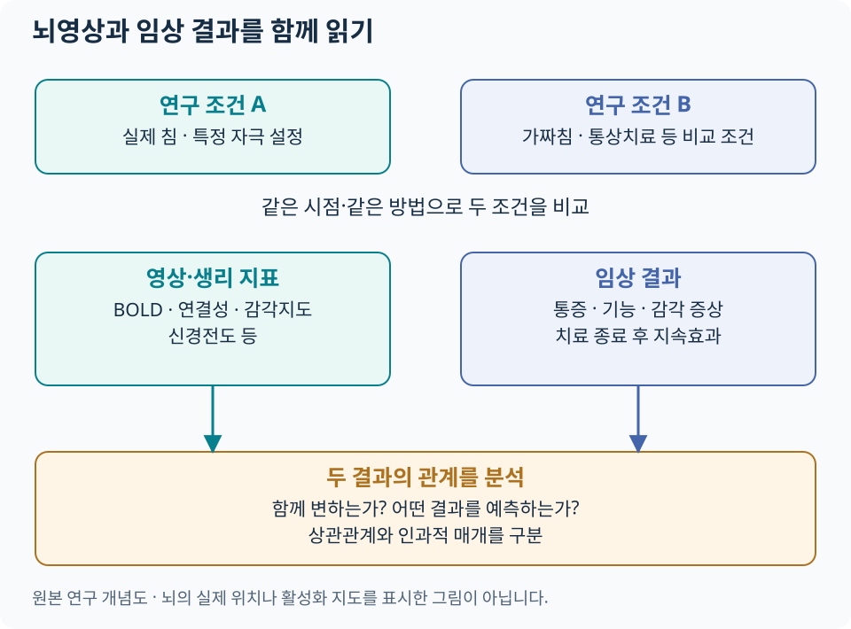

# 침과 뇌·중추신경계 {#_1}

뇌영상은 살아있는 사람에서 침 자극과 치료 전후의 신경계 변화를 탐색하는 방법입니다. **영상이 측정한 값, 비교한 조건, 환자의 임상 변화**를 나누어 읽으면 연구의 의미를 더 정확하게 이해할 수 있습니다.

## 반복적으로 연구되는 뇌 영역 {#_2}

| 영역·네트워크 | 우리말·주요 기능 | 침 연구에서 보는 질문 |
|---|---|---|
| S1·S2 | 일차·이차 체성감각피질. 신체 감각의 위치·특성 처리 | 자극 부위의 감각 표현과 감각지도가 변하는가 |
| 시상(thalamus) | 여러 감각 입력과 피질 회로를 연결 | 감각 전달과 다른 영역의 상호작용이 달라지는가 |
| 섬엽(insula) | 신체 내부 감각·정서·중요성 평가에 참여 | 통증의 불쾌감·신체감각 처리와 관계가 있는가 |
| 앞대상피질(ACC) | 정서·주의·행동 조절에 참여 | 통증에 대한 반응과 조절이 어떻게 변하는가 |
| 전전두피질(PFC) | 기대·인지적 조절·의사결정에 참여 | 치료 맥락과 통증조절의 관계는 무엇인가 |
| PAG | 뇌간 하행성 통증조절에 참여 | 척수 통각 처리와의 연결이 달라지는가 |
| 기본모드 네트워크(DMN) | 내적 사고·자기 관련 처리 등에 참여 | 휴식 상태 네트워크와 지속 통증의 관계는 무엇인가 |
| 감각운동·전두두정 네트워크 | 감각·운동, 주의·인지 조절에 참여 | 기능과 감각 처리의 변화가 함께 나타나는가 |

영역의 기능은 서로 겹치며 통증에만 전용된 것은 아닙니다. 영상에서 한 영역의 차이가 관찰되었다는 사실만으로 환자의 통증이나 특정 심리 상태를 역으로 단정하지 않습니다. 네트워크 연구의 예는 [2022년 좌표 기반 메타분석](https://pubmed.ncbi.nlm.nih.gov/36590302/)에서 확인할 수 있습니다.

## 뇌영상의 측정값 읽기 {#imaging-measures}

[도해 크게 보기](../assets/acupuncture-science/brain-evidence.svg)

| 용어 | 무엇을 뜻하나 | 해석에 필요한 구분 |
|---|---|---|
| BOLD fMRI | 혈중 산소화와 관련된 MRI 신호의 변화 | 신경발화를 직접 세는 값이 아닌 혈역학적 지표 |
| 과제 기반 fMRI | 특정 자극·동작 조건 사이의 신호 비교 | 비교 과제와 감각 강도·주의 조건을 확인 |
| 휴식상태 기능적 연결성(rsFC) | 영역 간 시간에 따른 신호 변동의 통계적 관계 | 해부학적 신경선의 연결이나 인과 방향을 직접 뜻하지 않음 |
| ALFF·fALFF | 저주파 BOLD 변동의 크기와 상대적 크기 | 활동의 한 측면을 수치화한 것으로 효과 크기와 구분 |
| ReHo | 가까운 지점들의 신호 변동이 얼마나 비슷한지 | 국소 신호의 동조성 지표이며 임상 회복 점수와 구분 |
| 구조 MRI·확산영상 | 구조·조직의 형태와 물 확산 특성 | 기능적 연결성과 서로 다른 측정 |
| PET | 추적자에 따른 대사·수용체 관련 신호 | 어떤 추적자와 분석을 썼는지 확인 |

BOLD의 생리적 배경은 [Logothetis의 해설](https://pmc.ncbi.nlm.nih.gov/articles/PMC1693017/), 침 연구의 ALFF·ReHo 분석 예는 [Yu 등의 메타분석](https://pubmed.ncbi.nlm.nih.gov/36590302/)을 참고합니다. 뇌영상은 이 분야에서 연구 도구로 사용되며, 일반 진료에서 개인의 침 효과를 판정하는 정규 검사로 확립된 것은 아닙니다.

## 사람 대상 원저: 손목터널증후군 {#carpal-tunnel-study}

Maeda 등의 2017년 *Brain* 연구는 손목터널증후군 환자 80명을 국소 침, 원위부 침, 가짜침군으로 무작위 배정하고 증상·정중신경 전도·S1 손가락 감각지도를 함께 평가했습니다.

| 관찰 | 결과를 읽는 방법 |
|---|---|
| 세 군 모두 증상 중증도 감소 | 환자 보고 증상은 대조군과의 차이를 함께 봄 |
| 실제 침군에서 가짜침보다 신경전도·감각지도 지표 개선 | 주관적 증상과 생리적 지표의 결과가 서로 다를 수 있음 |
| S1 감각지도 변화와 3개월 후 증상 개선의 관계 | 장기 반응을 예측하는 단서를 제시하지만 단독 원인 증명과는 구분 |

이 연구는 말초신경 질환에서도 중추 감각 표현을 함께 살펴볼 수 있음을 보여 줍니다. 모든 만성통증이나 모든 자침 부위에 동일한 결과를 적용하지 않고, 해당 환자군의 연구로 읽습니다. [원저: Maeda 등, 2017](https://pubmed.ncbi.nlm.nih.gov/28334999/). 진료 내용은 [손목터널증후군](../conditions/carpal-tunnel.md), 연구 비교는 [질환 근거 카드](../authority/conditions/carpal-tunnel.md)로 이어집니다.

## 최신 만성통증 근거 {#_3}

| 연구 | 범위 | 관찰·해석 |
|---|---|---|
| Yu 등, 2022 — 좌표 기반 메타분석 | 14개 연구·만성통증 환자 524명 | ALFF·ReHo 변화의 공간적 분포를 종합. DMN·전두두정 네트워크와 관련된 변화 탐색 |
| Ma 등, 2026 — 체계적 문헌고찰·메타분석 | 17 RCT·750명 | 뇌영상 지표와 통증 결과를 함께 종합. 통증 유형·영상 방법·비교군의 차이와 짧은 추적기간을 고려 |

출처: [Yu 등, 2022](https://pubmed.ncbi.nlm.nih.gov/36590302/), [Ma 등, 2026](https://pubmed.ncbi.nlm.nih.gov/42147848/). 두 분석의 대상 문헌이 독립적이라고 보장할 수 없으므로 표본수를 합산하지 않습니다. 서로 다른 영상 지표의 변화량을 ‘뇌 기능 회복률’로 바꾸어 표현하지 않습니다.

## 해석 {#_4}

### 대조군과 치료 맥락 {#comparators}

실제 침과 가짜침의 비교는 자극 위치·침투·감각 등의 차이를 살펴봅니다. 통상치료·대기군과의 비교는 치료를 추가했을 때의 전체적인 임상 차이를 묻습니다. 접촉·기대·주의·치료자와의 상호작용도 환자의 경험과 신경계 반응에 관여할 수 있으므로, 가짜침을 완전히 생리적으로 비활성인 조건이라고 가정하지 않습니다. 실제 사례는 위 [손목터널 연구](#carpal-tunnel-study)에서 볼 수 있습니다.

### 논문 그림과 결과표에서 확인할 것 {#reading-checks}

1. **어떤 비교인가?** 치료 전후 변화인지, 무작위 배정한 군 사이의 변화량 차이인지 확인합니다.
2. **무엇을 측정했나?** BOLD·연결성·구조 지표를 구별하고 움직임·호흡 등 측정 영향을 확인합니다.
3. **분석이 얼마나 안정적인가?** 표본수, 사전 계획, 다중비교 보정, 독립 표본 재현을 봅니다.
4. **환자에게 어떤 변화가 있었나?** 통증·기능·지속효과와 영상 변화의 관계를 따로 읽습니다.

영상 변화와 통증 감소의 상관은 기전을 연구할 단서입니다. 그 변화가 치료 효과를 매개했다는 인과적 결론에는 추가적인 설계와 검증이 필요합니다. [척수·하행성 통증조절](pain-modulation.md) · [근거 읽기](../acupuncture-integrated/evidence.md) · [치료 경과 평가](../acupuncture-integrated/followup.md).
