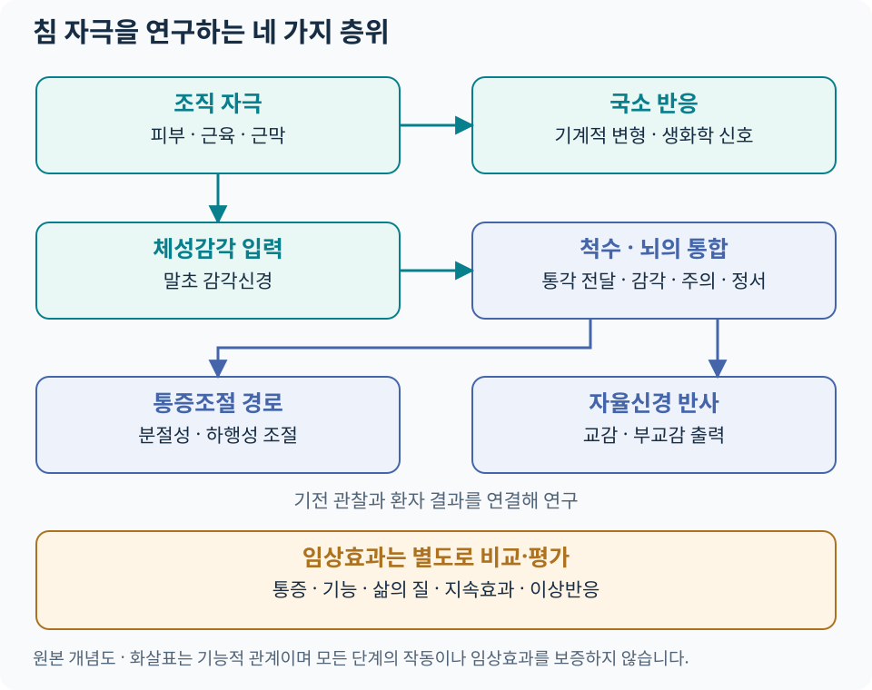

# 침의 과학적 접근 {#_1}

침 치료를 현대 생의학적으로 이해하려면 **어떤 조직에 어떤 자극이 전달되는지, 신경계에서 무엇이 변하는지, 환자의 통증과 기능이 얼마나 좋아지는지**를 차례로 살펴봅니다. 경혈·경락과 동씨기혈은 치료 위치를 찾는 체계이며, 같은 부위를 근육·근막·피부감각신경·척수분절이라는 해부학적 관점에서도 읽을 수 있습니다.

이 파트는 말초조직, 척수 통증조절, 뇌 네트워크, 자율신경 반사의 네 축을 다룹니다. 기전 연구는 작용 경로를 탐색하고, 임상시험은 특정 환자군에서 치료의 이득과 위해를 비교합니다. 두 질문을 함께 읽으면 연구 결과를 진료에 연결하기 쉬워집니다.

## 핵심 흐름 {#_2}

[도해 크게 보기](../assets/acupuncture-science/overview.svg)

피부·근육·결합조직에서 시작한 자극은 체성감각 입력으로 전달되고, 국소 반응과 척수·뇌의 조절에 관여할 수 있습니다. 자율신경 반사도 이 입력과 연결되는 연구 경로입니다. **각 경로는 서로 영향을 주며, 모든 단계를 반드시 순서대로 거쳐야 하는 하나의 사슬은 아닙니다.** 도해는 본문을 바탕으로 직접 제작한 개념도이며 실제 신경의 위치나 자침 경로를 표시한 해부도는 아닙니다.

## 주요 지식망 {#_3}

| 궁금한 질문 | 읽을 문서 | 핵심 내용 |
|---|---|---|
| 침이 피부·근육·근막에서 어떻게 감지되나요? | [말초신경과 침 자극](peripheral-afferent.md) | 조직층, Aβ·Aδ·C 섬유, 기계적 신호변환, 아데노신 |
| 아픈 곳에서 떨어진 자극을 어떻게 연구하나요? | [침과 통증조절 신경생리](pain-modulation.md) | 척수분절, 상행·하행 조절, 내인성 오피오이드, 감작 |
| 뇌영상에서 색이 바뀌면 무엇을 뜻하나요? | [침과 뇌·중추신경계](brain-central.md) | BOLD·기능적 연결성, 감각지도, 연구 대조군 |
| HRV와 미주신경 연구는 어떻게 다른가요? | [침과 자율신경계](autonomic.md) | 체성–자율신경 반사, 생쥐 회로 실험, 사람의 기능 평가 |
| 전침의 주파수와 강도는 무엇을 바꾸나요? | [전침 자극 파라미터](../treatments/electroacupuncture.md#electroacupuncture-settings) | 주파수·강도·펄스폭·연결 부위·시간 |
| 실제 효과는 어디서 확인하나요? | [침 연구·임상근거](../acupuncture-integrated/evidence.md) | 질환별 비교군, 통증·기능, 효과 크기와 지속기간 |

## 현대 연구에서 반복되는 주요 축 {#_4}

| 연구 층위 | 대표적인 관찰·실험 | 현재 읽을 수 있는 의미 |
|---|---|---|
| 국소조직 | 사람의 침 회전·인출력 실험, 국소 아데노신 측정 | 물리적 자극과 생화학적 변화가 실제로 측정됨 |
| 말초·척수 | 신경활동 기록, 수용체 차단·유전자 조작 동물실험 | 특정 실험 조건에서 신경·수용체가 반응에 기여하는지 검증 |
| 뇌 네트워크 | 사람의 치료 전후 fMRI와 신경전도·증상 평가 | 감각처리 변화와 임상 변화의 관계를 탐색 |
| 자율신경 | 동물의 회로 추적, 사람의 HRV·혈압·장기 기능 측정 | 회로의 인과 검증과 임상 지표의 관찰을 구분 |

대표 원저는 [Langevin 등, 2001](https://pubmed.ncbi.nlm.nih.gov/11717207/), [Takano 등, 2012](https://pubmed.ncbi.nlm.nih.gov/23182227/), [Maeda 등, 2017](https://pubmed.ncbi.nlm.nih.gov/28334999/), [Liu 등, 2021](https://pubmed.ncbi.nlm.nih.gov/34646018/)입니다. 각 연구의 대상·결과·적용 범위는 해당 세부 문서에서 설명합니다.

### 기전에서 임상효과로 연결할 때 {#mechanism-to-clinic}

논문을 읽을 때 **대상 → 자극 → 비교군 → 평가값 → 추적기간**을 확인합니다. 예를 들어 건강인의 생화학적 변화, 통증 동물의 회피반응 감소, 만성통증 환자의 일상기능 개선은 서로 다른 결과입니다. 같은 용어로 모두 ‘치료 성공’이라고 묶기보다, 연구가 직접 측정한 결과를 먼저 적습니다.

| 논문의 질문 | 적합한 근거 | 함께 확인할 항목 |
|---|---|---|
| 이 회로가 반응에 필요한가? | 차단·제거·활성화 실험 | 종, 모델, 자극 조건, 다른 경로의 영향 |
| 사람에서도 생리 변화가 있는가? | 생리·영상 연구 | 대조 조건, 측정 오차, 증상과의 관계 |
| 환자에게 도움이 되는가? | RCT·체계적 문헌고찰 | 비교군, 효과 크기·신뢰구간, 기능·위해·지속효과 |
| 어느 상황에 권고하는가? | 진료지침 | 질환·중증도, 대안 치료, 근거 확실성과 권고 강도 |

대조군에 따른 질문과 질환별 근거 카드는 [근거·연구](../acupuncture-integrated/evidence.md)에서 이어집니다. [사암침법과 현대 연구](../acupuncture-specific/saam-evidence.md)에서는 원위혈의 감각 입력 연구와 실제 정격·승격을 시험한 임상연구를 구분해 읽습니다.

## 아카이브 연결 {#_5}

**위치를 찾을 때**는 [361경혈 아틀라스](../acupoint-network/standard-atlas.md)와 [동씨침법 부위별 아틀라스](../tung-acupuncture/index.md), **조직을 확인할 때**는 [근육·근막·MPS 아틀라스](../clinical-anatomy/mps-atlas.md)와 [임상해부학](../clinical-anatomy/index.md)을 함께 봅니다. 경혈·동씨기혈·통증유발점은 위치가 겹칠 수 있지만 각각의 정의와 선정 기준을 기록합니다.

저림·근력저하가 있으면 [신경포착증후군](../nerve-entrapment/index.md)을 감별하고, 조직층과 주변 구조는 [근골격계 초음파](../musculoskeletal-ultrasound/index.md)로 연결합니다. 치료 계획은 [안전·위험신호](../acupuncture-integrated/safety.md), 반복 치료의 판단은 [경과·재평가](../acupuncture-integrated/followup.md)를 참고합니다.

### 진료 기록에 연결하는 예 {#clinical-record}

다음은 기록 구조의 예시이며 실제 환자의 치료 결과가 아닙니다.

| 기록 항목 | 어깨 통증에서 적을 내용의 예 |
|---|---|
| 치료 전 질문 | 어떤 동작에서 아픈가, 목에서 오는 증상이나 신경학적 이상이 있는가 |
| 위치와 조직 | 선택한 경혈·압통 부위, 관련 근육·근막, 주변 신경·혈관 |
| 자극 | 수기침·전침 여부, 자극 설정과 환자 반응 |
| 결과 | 팔 올리기·옷 입기·수면 등 미리 정한 기능과 통증의 변화 |
| 다음 판단 | 개선의 지속기간, 이상반응, 운동·부하 조절, 추가 평가 필요성 |

과학적 설명의 역할은 이 기록에서 **자극과 관찰 결과 사이의 질문을 구체화하는 것**입니다. 치료 효과의 최종 판단에는 환자가 체감하는 변화와 기능 회복을 함께 반영합니다.
