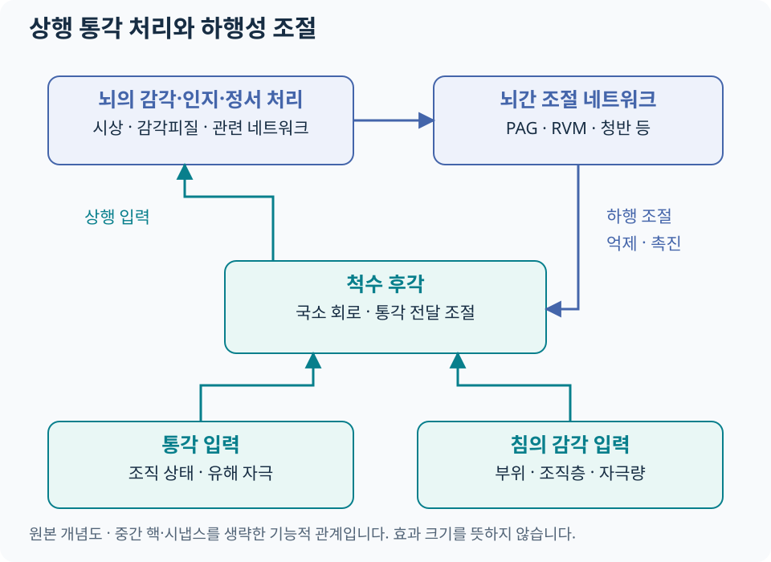

# 침과 통증조절 신경생리 {#_1}

침의 진통 연구는 말초에서 들어온 감각 입력이 **척수에서 전달·조절되고, 뇌의 감각·정서·주의 및 하행성 조절계와 상호작용하는 과정**을 다룹니다. 통각(nociception)은 유해 자극을 신경계가 처리하는 과정이고, 통증(pain)은 개인이 경험하는 감각·정서적 경험입니다. 신경활동이나 반사만으로 통증 경험 전체를 대신 측정할 수는 없습니다. [IASP 용어 기준](https://www.iasp-pain.org/resources/terminology/).

## 척수 후각 {#_2}

척수 후각은 말초 통각 입력, 국소 신경회로, 뇌간에서 내려오는 신호가 만나는 곳입니다. 분절성 조절은 특정 척수분절에서 감각 입력들의 상호작용을 살펴보는 관점입니다. 관문조절(gate control)은 이를 이해하는 기본 틀이며, 실제 회로에는 다양한 흥분성·억제성 뉴런이 참여합니다.

| 연구 대상 | 관찰하는 질문 |
|---|---|
| 광범위역동범위 뉴런(WDR neuron) | 여러 강도의 감각 입력에 반응하는 양상이 달라지는가 |
| 척수 시냅스 가소성·장기강화(LTP) | 반복 자극 뒤 통각 전달이 지속적으로 증폭·조절되는가 |
| 억제성 신경회로 | GABA·글리신 등 억제성 전달이 어떻게 관여하는가 |
| 미세아교세포·성상세포 | 신경–면역 신호와 통각 과민의 관계가 달라지는가 |

이는 주로 동물·실험 연구에서 다루는 질문입니다. 특정 기전의 변화와 사람의 치료 결과를 연결할 때는 대상과 비교 조건을 확인합니다. [침 통증조절 기전 리뷰, 2020](https://pubmed.ncbi.nlm.nih.gov/32420752/).

## 하행성 통증조절계 {#_3}

[도해 크게 보기](../assets/acupuncture-science/pain-modulation.svg)

| 영역 | 한글 명칭·역할 |
|---|---|
| PAG | 수도관주위회색질. 뇌간 통증조절 네트워크의 주요 영역 |
| RVM | 입쪽배안쪽연수. 척수 통각 전달의 억제·촉진에 관여 |
| 청반 등 노르아드레날린성 핵 | 척수로 향하는 모노아민성 조절 경로에 관여 |
| 전전두·대상피질 | 주의·기대·정서와 통증조절 네트워크의 상호작용에 관여 |

하행성 조절에는 억제와 촉진이 모두 있습니다. 따라서 ‘뇌간이 활성화되었다’는 관찰을 곧바로 진통의 증거로 읽기보다, 어떤 세포·경로와 통증 평가가 함께 변했는지 확인합니다. 도해의 화살표는 여러 중간 단계를 생략한 기능적 관계입니다. [지속 통증의 침·전침 기전 리뷰](https://pubmed.ncbi.nlm.nih.gov/24322588/).

원위부 자극의 효과를 연구할 때에는 분절 관계와 중추 조절을 함께 고려할 수 있습니다. 실제 위치 선정은 [경혈·경락](../acupoint-network/standard-atlas.md), [동씨기혈](../tung-acupuncture/index.md), 질환별 비교시험을 함께 읽습니다. 원위부에서 변화가 있었다는 사실만으로 특정 경로 하나를 확정하지 않습니다.

## Endogenous opioid {#endogenous-opioid}

내인성 오피오이드는 몸 안에서 만들어지는 β-엔도르핀·엔케팔린·다이노르핀 등의 펩타이드를 말합니다. 침·전침 연구에서는 수용체 차단, 신경펩타이드 측정 등을 통해 이 체계의 기여를 조사해 왔습니다. [전침의 임상 적용·엔도르핀 기전 리뷰](https://pubmed.ncbi.nlm.nih.gov/23917395/).

### 전침 주파수 연구를 읽는 법 {#frequency-dose}

저주파·고주파에 따라 관여하는 신경펩타이드와 수용체 반응이 달라질 수 있다는 실험은 전침 연구의 중요한 출발점입니다. 그러나 주파수만으로 질환별 치료 설정을 정할 수는 없습니다. 연구를 비교할 때 아래 항목을 함께 적습니다.

| 자극 변수 | 논문·진료 기록에서 확인할 것 |
|---|---|
| 주파수 | Hz, 고정·교대 여부 |
| 전류와 펄스폭 | 강도 단위, 한 펄스의 시간, 환자의 감각 반응 |
| 파형·연결 부위 | 기기 조건, 전극 연결, 선택한 조직·부위 |
| 시간·반복 | 한 회의 자극시간, 치료 간격·횟수 |
| 치료 맥락 | 수기 자극, 운동·약물 등 병행 치료, 비교군 |

설정의 임상적 의미는 [전침의 주파수·강도](../treatments/electroacupuncture.md#electroacupuncture-settings)에서 이어집니다. 동물 실험의 자극 역치를 사람에게 그대로 적용하거나 강한 감각을 효과의 대용 지표로 삼지 않습니다.

## 비-opioid 신경전달물질 {#-opioid}

세로토닌·노르아드레날린·도파민·글루탐산·GABA·아세틸콜린 등도 연구됩니다. 같은 전달물질이더라도 수용체 아형과 작용 위치에 따라 결과가 달라질 수 있습니다. 따라서 ‘세로토닌이 늘면 통증이 감소한다’는 단일 공식보다 **경로·수용체·행동 결과를 함께 검증했는지**를 봅니다. [통증조절 기전 리뷰](https://pubmed.ncbi.nlm.nih.gov/32420752/).

## 말초 감작·중추 감작과 MPS {#sensitization}

말초 감작은 말초 통각수용기의 반응성이 높아지는 현상이며, 중추 감작은 중추 통각 뉴런의 반응성이 높아지는 현상입니다. 통각가소성 통증(nociplastic pain)은 변화된 통각 처리를 설명하는 임상적 기전 용어로, 중추 감작의 실험적 개념과 완전히 같은 말은 아닙니다. [IASP 용어 기준](https://www.iasp-pain.org/resources/terminology/).

MPS를 평가할 때는 국소 압통·연관통·움직임뿐 아니라 통증의 분포와 지속기간, 감각이상, 수면·활동 제한도 봅니다. 만성이라는 이유만으로 모두 중추 감작으로 분류하거나, 모든 저림을 통증유발점으로 설명하지 않습니다. [MPS 평가](../clinical-anatomy/mps-atlas.md#assessment)와 [신경포착 감별](../nerve-entrapment/index.md)을 연결합니다.

## 임상 연결 {#_4}

치료 전후에는 같은 동작·같은 척도로 비교합니다. 즉시 통증 감소와 며칠 뒤의 기능 회복, 치료 종료 뒤 유지 효과는 각각 기록할 가치가 있습니다.

| 평가 영역 | 비교할 항목의 예 |
|---|---|
| 통증 | 강도, 빈도, 악화 동작, 야간 통증 |
| 기능 | 보행·앉기·팔 올리기 등 환자가 선택한 활동 |
| 생활 | 수면 방해, 업무·운동 복귀, 진통제 사용 변화 |
| 경과·안전 | 효과의 지속기간, 치료 후 악화·멍·감각 변화 |

개선이 유지되면 활동·운동을 회복하는 계획과 연결하고, 반응이 부족하면 진단·부위·자극량·병행 치료를 다시 검토합니다. [경과·재평가](../acupuncture-integrated/followup.md) · [질환별 현대 근거 카드](../authority/conditions/index.md) · [근거 가이드](../evidence-guide/index.md).
