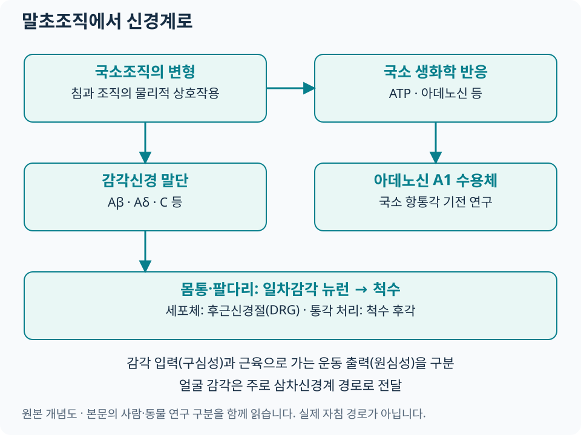

# 말초신경과 침 자극 {#_1}

침 자극의 첫 단계는 **국소조직의 물리적 변화를 감각신경과 주변 세포가 받아들이는 과정**입니다. 같은 피부 표면의 위치라도 관여하는 조직층과 자극 방식이 다르면 신경계에 들어가는 입력이 달라질 수 있습니다.

## 조직층과 기계적 신호변환 {#tissue-layers}

| 관찰할 층·구조 | 과학적으로 묻는 질문 | 해부학 자료 |
|---|---|---|
| 피부·피하조직 | 압박·신장·접촉이 어떤 감각 입력을 만드는가 | [조직층 개념도](../clinical-anatomy/mps-atlas.md#layers) |
| 근육·근막 | 조직 변형과 근육 감각 입력이 어떻게 연결되는가 | [부위별 MPS 아틀라스](../clinical-anatomy/mps-atlas.md#regions) |
| 말초신경과 주변 조직 | 감각분포·운동기능·포착 소견이 증상과 맞는가 | [임상해부학](../clinical-anatomy/index.md) |
| 혈관·건·관절 주변 | 인접 구조와 관찰한 조직층을 어떻게 구분하는가 | [초음파 조직 해부학](../musculoskeletal-ultrasound/index.md#tissue-anatomy) |

기계적 신호변환(mechanotransduction)은 조직의 변형이 세포의 전기적·생화학적 신호로 바뀌는 과정을 뜻합니다. 사람을 대상으로 한 Langevin 등의 실험에서는 침 회전에 따라 침을 빼는 데 필요한 힘이 달라지는 현상을 측정했습니다. 이는 침–조직 사이의 물리적 상호작용을 보여 주며, 임상 통증의 장기 개선을 평가한 시험과는 연구 질문이 다릅니다. [원저: J Appl Physiol, 2001](https://pubmed.ncbi.nlm.nih.gov/11717207/).

근막의 연속성과 신경·세포의 반응을 연구할 수 있지만, 그것만으로 근막과 경락의 해부학적 일치를 확정하지는 않습니다. MPS에서는 [익숙한 통증의 재현·연관통·기능 평가](../clinical-anatomy/mps-atlas.md#assessment)를 함께 기록합니다.

## 감각신경 섬유 {#_2}

[도해 크게 보기](../assets/acupuncture-science/peripheral.svg)

| 섬유 | 일반적인 특성 | 침 연구에서의 의미 |
|---|---|---|
| Aβ | 비교적 굵은 유수섬유, 주로 낮은 역치의 기계감각 | 촉각·압박 입력과 척수 내 조절을 연구 |
| Aδ | 가는 유수섬유, 일부 기계·온도·통각 입력 | 자극 특성에 따른 빠른 통각 및 감각 반응에 관여 |
| C | 무수섬유, 다양한 통각·온도·화학감각 기능 | 자극·조직 상태에 따른 느린 감각 입력과 국소 반응에 관여 |

이 분류는 감각의 경향을 설명합니다. ‘묵직함은 특정 섬유 하나’, ‘특정 전류는 누구에게나 같은 섬유’처럼 일대일로 대응시키기 어렵습니다. 2024년 구심성 신경 리뷰도 부위·조직층·자극 방식·강도를 함께 다룹니다. [Fan 등, 2024](https://pubmed.ncbi.nlm.nih.gov/38384495/).

몸통·팔다리의 일차감각 뉴런은 세포체가 **후근신경절(DRG)**에 있고, 중추로 향하는 가지가 척수로 들어갑니다. DRG를 시냅스가 일어나는 중계핵처럼 그리지 않도록 주의합니다. 척수 후각에서의 통각 처리는 [척수·하행성 조절](pain-modulation.md#_2)로 이어집니다. 얼굴의 감각은 주로 삼차신경계 경로를 이용하므로 몸통·팔다리의 척수 경로와 구분합니다. [후근신경절 해부학](https://www.ncbi.nlm.nih.gov/books/NBK532291/) · [삼차신경 해부학](https://www.ncbi.nlm.nih.gov/books/NBK482283/).

## ATP·Adenosine {#atpadenosine}

ATP는 세포 밖에서 신호물질로 작용할 수 있고, 분해 과정에서 생성되는 아데노신은 별도의 수용체를 통해 작용합니다. **ATP 신호와 아데노신 A1 수용체 작용을 모두 같은 방향의 진통 작용으로 묶지 않고** 각각의 수용체·실험 조건을 확인합니다.

| 연구 | 무엇을 했나 | 직접 관찰한 결과와 범위 |
|---|---|---|
| Goldman 등, 2010 — 동물 기전 연구 | 생쥐의 국소 아데노신과 A1 수용체를 조작·측정 | 국소 항통각 반응에서 A1 수용체의 기여를 제시. 사람의 최적 치료량은 별도 질문 |
| Takano 등, 2012 — 사람 생리 연구 | 족삼리 부위 침 자극 전·중·후 미세투석으로 조직액 측정 | 국소 아데노신 농도 증가를 관찰. 만성통증 환자의 장기 효과를 입증하는 RCT는 아님 |

출처: [Goldman 원저](https://pubmed.ncbi.nlm.nih.gov/20512135/), [Takano 원저](https://pubmed.ncbi.nlm.nih.gov/23182227/). 두 연구를 함께 읽으면 동물에서의 수용체 검증과 사람에서의 생리 관찰이 어떤 관계인지 이해할 수 있습니다.

## TRPV·말초 수용체 {#trpv}

TRPV1을 비롯한 TRP 계열 이온통로, 아데노신·오피오이드·칸나비노이드 수용체, 여러 신경매개물질이 말초 항통각 연구의 대상입니다. 같은 분자도 자극을 감지하는 단계와 염증·과민성이 바뀌는 단계에서 역할이 다를 수 있어, 증가·감소 자체보다 **어느 세포에서 무엇을 측정했는지**를 봅니다.

2021년 리뷰는 말초 수용체·매개물질에 관한 전임상 연구 29편을 검토했습니다. 해당 결과는 실험 모델의 설명에 활용하고, 특정 경혈의 임상 적응증이나 환자의 수용체 상태를 추정하는 검사로 사용하지 않습니다. [Peripheral receptors and neuromediators review](https://pubmed.ncbi.nlm.nih.gov/33474636/).

## 임상해부학 연결 {#_3}

기록은 **위치 → 조직층 → 감각분포 → 운동기능 → 관련 신경근·말초신경 → 치료 후 변화** 순서로 정리할 수 있습니다. 감각 입력은 구심성, 근육으로 가는 운동 출력은 원심성 경로입니다. 근육을 지배하는 운동신경 이름만으로 침의 모든 감각 경로를 설명하지 않습니다.

| 진찰에서 관찰한 것 | 다음에 확인할 내용 |
|---|---|
| 근육 압박에서 익숙한 통증이 재현됨 | [MPS 평가](../clinical-anatomy/mps-atlas.md#assessment), 움직임과 부하에 따른 변화 |
| 특정 감각분포의 저림·감각저하 | [신경포착](../nerve-entrapment/index.md), 근력·반사·신경근 분포 |
| 경혈 부위와 증상 부위가 떨어져 있음 | [분절·중추 통증조절](pain-modulation.md), 해당 질환의 임상근거 |
| 조직층이나 인접 구조 확인이 필요함 | [근골격계 초음파](../musculoskeletal-ultrasound/index.md)와 [안전 안내](../acupuncture-integrated/safety.md) |

침을 받는 동안의 묵직함·당김 등 감각은 설명하고 기록하되, 강한 전격통이나 지속되는 저림·새로운 근력저하는 즉시 의료인에게 알리고 신경 상태를 확인합니다. 신경계의 반응을 얻기 위해 신경줄기를 직접 찌르는 것을 목표로 삼지 않습니다.

[침의 과학적 접근](index.md) · [361경혈 임상 아틀라스](../acupoint-network/standard-atlas.md)
