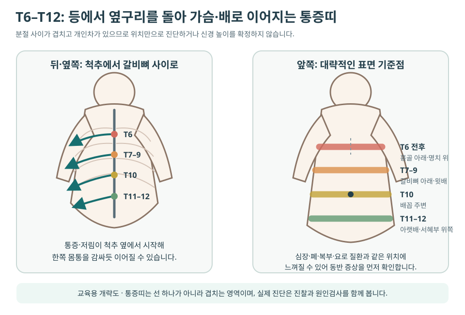

# 늑간신경통·갈비뼈를 따라 띠처럼 아파요

늑간신경통은 하나의 병명으로 원인이 확정됐다는 뜻보다 **갈비뼈 사이 신경을 따라 등에서 옆구리·가슴 또는 윗배로 감싸는 신경병증성 통증 양상**을 가리킵니다. 화끈거림·전기통·저림·감각저하가 띠처럼 이어지거나 옷이 스치기만 해도 아플 수 있습니다.

비슷한 위치의 통증은 늑간근·늑골관절, 흉추 신경근, 대상포진, 갈비뼈 손상뿐 아니라 심장·폐·담낭·췌장·신장 문제에서도 생깁니다. 따라서 ‘늑간신경통’이라고 자가진단하기 전에 **흉통·호흡곤란·발열·복부 증상·외상·피부 변화와 신경학적 이상**을 먼저 확인합니다.

!!! tip "핵심 구분"
    피부 표면이 화끈거리거나 스치면 아프고 한쪽 띠 모양으로 이어지면 신경통을 의심할 수 있습니다. 그러나 눌러서 재현된다는 이유만으로 심폐·복부 질환이 완전히 배제되지는 않습니다.

## 먼저 응급·우선평가 신호를 확인합니다

- 가슴을 짓누르는 통증, 호흡곤란, 식은땀·메스꺼움 또는 팔·턱으로 퍼지는 통증
- 가슴이나 등에서 갑자기 시작한 찢어지는 듯한 극심한 통증, 실신·의식저하
- 숨 쉴 때 심해지는 흉통과 갑작스러운 호흡곤란, 객혈, 입술이 파래짐
- 고열·오한·기침·전신쇠약과 함께 이어지는 흉곽 통증
- 큰 충격 뒤 갈비뼈 통증, 호흡 곤란, 어지럼 또는 항응고제 복용 중 생긴 넓은 멍
- 심한 상복부통증·반복 구토·황달, 혈뇨·배뇨통 등 흉복부 장기 증상
- 다리 힘이 빠지거나 걸음이 달라지고, 몸통 아래 감각·대소변 기능이 변함
- 암·면역저하 병력, 설명되지 않는 체중감소와 지속적인 야간통

한쪽 가슴이나 배가 화끈거린 뒤 물집이 생기면 [대상포진](shingles.md) 가능성이 있으므로 초기 항바이러스 치료 시점을 놓치지 않도록 빠르게 진료받습니다.

## 통증 양상으로 원인을 나눠 봅니다

| 통증의 특징 | 우선 살필 원인 | 함께 확인할 단서 |
|---|---|---|
| 한쪽 갈비뼈를 따라 화끈·찌릿, 옷이 닿아도 아픔 | 늑간신경통, 대상포진 전후 신경통 | 피부 과민·감각저하, 발진·수포, 수술·외상력 |
| 등에서 시작해 가슴·윗배로 띠처럼 감싸고 기침·몸통 자세에 변함 | 흉추 신경근병증·흉추디스크 | 척추 주변 통증, 분절성 저림, 보행·근력 변화 |
| 특정 갈비뼈 사이가 눌러 아프고 깊은 호흡·회전에 악화 | 늑간근·늑골관절·흉벽 통증 | 기침·운동·무거운 물건 들기, 국소 압통 |
| 외상·심한 기침 뒤 한 점의 뼈 통증 | 늑골 골절·피로골절 | 골다공증, 호흡통, 멍·변형 |
| 수포가 아문 뒤에도 작열통·전격통·이질통이 지속 | 대상포진 후 신경통 | 과거 발진 위치, 감각저하, 야간통·수면장애 |
| 흉통·숨참·발열 또는 식사·구토·배뇨와 연동 | 심장·폐·흉막·담낭·췌장·신장 등 | 운동·호흡·식사·소변과의 관계, 전신증상 |

늑간근 통증과 신경통은 함께 있을 수 있습니다. 통증 성질 하나보다 **피부 감각, 움직임, 호흡, 척추·갈비뼈 압통, 발진과 전신증상**을 묶어서 판단합니다.

## T6–T12 통증은 가슴과 배로 느껴질 수 있습니다

흉추 신경근과 늑간신경은 등에서 시작해 몸통을 감싸듯 이어집니다. 아래 그림은 위치를 이해하기 위한 **대략적인 교육용 지도**이며, 개인차와 분절 간 겹침이 커서 통증 위치만으로 신경 높이를 확정하지 않습니다.

| 대략적 높이 | 앞쪽에서 느낄 수 있는 범위 | 해석할 때 주의할 점 |
|---|---|---|
| **T6 전후** | 명치 윗부분·흉골 아래쪽 | 심장·폐·식도·상복부 원인을 먼저 감별 |
| **T7–T9 전후** | 갈비뼈 아래·윗배 | 담낭·위·췌장 등 장기 통증과 겹칠 수 있음 |
| **T10 전후** | 배꼽 주변 | 장·복벽 통증과 위치만으로 구분 불가 |
| **T11–T12 전후** | 아랫배·옆구리·서혜부 위쪽 | 요로·장·골반 원인과 상부 요추 신경을 함께 감별 |

통증띠가 정확히 한 선을 그리지 않거나 앞뒤 위치가 조금 어긋나는 것은 드문 일이 아닙니다. 반대로 같은 분절처럼 보여도 원인은 피부·근육·신경근·내장으로 서로 다를 수 있습니다.

## 왜 생기나요?

### 대상포진과 대상포진 후 신경통

대상포진은 한쪽 몸통의 통증·가려움·저림이 발진보다 며칠 먼저 시작할 수 있습니다. 피부가 아문 뒤에도 같은 띠에 작열통·전격통·이질통이 남으면 [대상포진 후 신경통](postherpetic-neuralgia.md)을 평가합니다.

### 흉추 신경근 자극

흉추디스크·추간공 협착, 드물게 종양·감염·골절 등이 신경근을 자극하면 등에서 앞가슴이나 배로 감싸는 통증이 생길 수 있습니다. 흉추 신경근병증은 목·허리 신경근병증보다 드물지만 복통이나 옆구리통증으로 오인될 수 있습니다. 보행 변화·다리 경직·근력저하가 있으면 신경근뿐 아니라 척수 압박을 우선 확인합니다.

### 수술·외상과 흉벽 과부하

흉부·유방·상복부 수술, 흉관 삽입, 갈비뼈 골절이나 직접 충격 뒤 신경이 자극될 수 있습니다. 반면 심한 기침·회전 운동 뒤의 통증은 늑간근이나 늑골관절에서 시작하는 경우가 흔합니다. 수술 후 통증은 신경 손상, 흉터, 근육 약화와 호흡 회피가 함께 작용할 수 있어 원인을 나눠 봅니다.

### 그 밖의 원인

당뇨병성 신경병증, 염증·감염, 종양, 대사 이상과 원인이 분명하지 않은 경우도 있습니다. 양쪽에 넓게 퍼지거나 다른 부위의 저림이 함께 있으면 국소 늑간신경만 보지 않고 전신 신경병증을 평가합니다.

## 진찰과 검사는 무엇을 보나요?

1. 통증 시작점과 앞뒤 경로를 몸 그림에 표시합니다.
2. 가벼운 접촉·온도·핀 자극에 대한 과민과 감각저하를 좌우 비교합니다.
3. 피부 발진·수포·흉터, 갈비뼈·흉추 압통과 몸통 회전·호흡 반응을 확인합니다.
4. 다리 근력·감각·반사, 보행과 균형을 확인해 척수 징후를 살핍니다.
5. 흉통·호흡기·복부·비뇨 증상에 따라 심전도, 흉부·복부 검사와 혈액·소변검사를 우선할 수 있습니다.

위험신호가 없는 단순 기계적 흉추통증은 즉시 MRI가 필요하지 않은 경우가 많습니다. 신경근성 통증이 지속되거나 척수 증상, 암·감염·골절 위험이 있으면 흉추 MRI·CT·X-ray를 원인에 맞춰 선택합니다. 비외상성 흉벽통증은 임상상에 따라 흉부 X-ray를 먼저 고려할 수 있습니다.

## 표준치료는 원인에 따라 달라집니다

- **대상포진:** 항바이러스 치료를 가능한 한 일찍 시작하고 급성 통증과 피부를 함께 관리합니다.
- **신경병증성 통증:** 가바펜티노이드, 일부 항우울제, 리도카인 같은 국소치료 등을 연령·신장기능·졸림·낙상 위험에 맞춰 사용합니다.
- **근육·늑골관절 통증:** 짧은 기간 부하를 조절하되 호흡과 일상 움직임을 지나치게 제한하지 않고 가동성과 근지구력을 회복합니다.
- **흉추 신경근병증:** 진행성 신경학적 결손이 없으면 약물·활동조절·재활을 우선할 수 있으며, 척수 압박이나 빠른 악화가 있으면 척추 전문평가가 필요합니다.
- **지속성 국소 신경통:** 원인이 확인되고 보존치료에 반응하지 않으면 통증의학과에서 진단적 신경차단 등 중재치료를 검토할 수 있습니다.

갈비뼈를 넓게 꽉 묶으면 호흡이 얕아질 수 있으므로 임의 압박 고정을 피합니다. 신경병증성 통증 약은 갑자기 끊거나 용량을 임의로 올리지 않습니다.

## 한의학에서는 어떻게 구분하나요? {#herbal-pattern}

| 병증·병기 | 통증과 동반 양상 | 치법·비교 처방군 | 맥설·확인 단서 |
|---|---|---|---|
| **기체협통·간기울결** | 스트레스·호흡에 따라 팽팽하고 옆구리를 당기는 통증, 한숨·흉민 | 소간이기·통락, 시호소간산 계열 등 | 현맥 경향, 설질 변화보다 긴장·소화·수면을 함께 확인 |
| **어혈조락** | 외상·수술 뒤 한 곳에 고정된 자통, 야간 악화 | 활혈거어·통락, 당귀수산·혈부축어탕 계열 등 | 설자암·어점, 맥삽 경향과 멍·압통·복용약 확인 |
| **한습조락** | 찬 바람·습기에 무겁고 시리며 온열에 편안 | 온경산한·제습통락, 오적산 계열 등 | 설담·백니태, 맥침긴 경향과 실제 냉온 반응 확인 |
| **습열·열독** | 대상포진 급성기의 붉은 수포·열감·작열통 | 청열이습·해독, 용담사간탕 계열 등 | 설홍·황니태, 맥활삭 경향; 항바이러스 치료와 피부 상태 우선 |
| **기혈허·음혈부족** | 오래된 통증, 피로·식욕저하·수면장애와 회복 지연 | 익기양혈·자음과 통락을 병행 | 설담 또는 건조, 맥허세 경향과 체중·영양·전신질환 확인 |

맥과 혀 하나로 흉추디스크나 장기 질환을 진단하지 않습니다. 흉복부 위험질환과 신경학적 이상을 먼저 배제하고, 통증 성질·발병 계기·냉온 반응·수면·소화·피로와 현재 약물을 함께 보아 처방을 조정합니다.

## 침·전침·약침·부항은 어떻게 적용하나요?

치료는 통증띠만 따라 자극하기보다 흉추와 늑골의 움직임, 주변 근육 긴장, 피부 감각과 원인을 함께 봅니다.

- **침:** 흉추 주변 협척혈, 배수혈, 옆구리 경락과 원위 혈위를 증상 분포와 변증에 맞춰 조합할 수 있습니다.
- **전침:** 만성 신경병증성 통증이나 근육 긴장에서 자극량을 일정하게 조절하는 방법으로 고려합니다.
- **약침:** 수술 후 흉터·근육 긴장이나 통증 분절 주변에 선택적으로 활용할 수 있으나 제제·알레르기·출혈 위험을 확인합니다.
- **부항:** 등과 견갑 주변의 넓은 근막 긴장 완화를 목표로 사용할 수 있습니다. 수포·감염·감각저하 피부는 피하고 안전한 부위를 선택합니다.

늑간 부위 바로 아래에는 신경혈관 다발이 지나고 깊은 곳에 흉막과 폐가 있어 **국소 침·전침·약침은 해부학적 안전이 특히 중요**합니다. 활동성 대상포진 병변과 감염 부위는 직접 자극하지 않으며, 시술 뒤 갑작스러운 흉통·호흡곤란이 생기면 기흉 등을 즉시 평가합니다.

늑간신경통의 침·약침 연구는 대상포진 후 신경통처럼 원인과 대상이 명확한 임상시험을 중심으로 축적되고 있습니다. 연구 대상과 일반적인 흉곽 통증의 차이를 구분하고, 치료 반응은 통증점수뿐 아니라 접촉통·호흡·수면·몸통 움직임으로 확인합니다.

## 호흡과 움직임은 단계적으로 회복합니다

위험질환과 골절·척수 문제를 배제한 뒤 다음 순서로 시행합니다.

1. **편안한 호흡:** 통증 없는 범위에서 코로 들이마시며 갈비뼈 옆과 뒤가 넓어지게 합니다.
2. **짧은 걷기:** 오래 누워 있기보다 하루 여러 번 짧게 걷고 호흡이 얕아지지 않는지 봅니다.
3. **가벼운 회전:** 옆으로 누워 무릎을 굽힌 뒤 위쪽 팔과 흉곽을 천천히 열어 몸통 회전을 회복합니다.
4. **견갑·몸통 지구력:** 벽 밀기, 밴드 당기기와 가벼운 물건 들기를 단계적으로 늘립니다.
5. **일상 복귀:** 기침·운전·운동·수면 자세에 따른 다음 날 통증 반응을 보며 부하를 조절합니다.

운동 중 통증띠가 넓어지거나 새로운 저림·다리 힘 빠짐·호흡곤란이 생기면 중단하고 재평가합니다. 대상포진 후 이질통이 심하면 거친 마찰·강한 마사지·뜨거운 찜질을 피합니다.

## 치료 반응은 이렇게 기록합니다

- 통증이 시작되는 지점과 앞쪽으로 퍼지는 범위
- 옷·이불·샤워를 견디는 정도와 피부 감각
- 깊은 호흡·기침·몸통 회전 때 통증
- 통증 때문에 깨는 횟수와 수면시간
- 진통제·신경병증성 통증 약의 용량과 돌발통 횟수
- 걷기·운전·업무·운동을 지속할 수 있는 시간
- 발진·수포 또는 근력·보행 변화의 새 발생 여부

## 자주 묻는 질문

### 늑간신경통이면 가슴이나 배가 아플 수 있나요?

가능합니다. 흉추 신경은 등에서 옆구리를 돌아 앞가슴과 배로 이어져 띠 모양 통증을 만들 수 있습니다. 다만 같은 위치에 심폐·위장·담낭·췌장·요로 질환도 나타날 수 있어 전신증상과 위험신호를 먼저 확인합니다.

### 발진이 없는데 대상포진일 수 있나요?

통증·가려움·저림이 발진보다 며칠 먼저 나타날 수 있습니다. 새 물집이 생기거나 한쪽 피부 과민이 빠르게 심해지면 조기에 진료받습니다. 발진 없이 통증만 지속되는 경우는 다른 원인도 많으므로 스스로 확정하지 않습니다.

### 흉추디스크가 보이면 통증 원인이 확실한가요?

아닙니다. 영상 변화와 실제 통증 분절, 감각이상, 신경학적 진찰이 일치해야 의미가 큽니다. 반대로 보행·근력·대소변 변화가 있으면 영상 소견의 크기와 관계없이 빠른 평가가 필요합니다.

### 늑간신경통에 침치료를 받을 수 있나요?

원인 평가 뒤 통증·호흡·몸통 움직임의 치료 목표에 맞춰 고려할 수 있습니다. 흉곽은 폐와 가까우므로 숙련된 의료인이 안전한 부위·방향·깊이를 선택해야 하며, 활동성 수포나 감염 부위는 피합니다. 대상포진·골절·심폐질환이 확인되면 해당 치료와 침구치료의 시점·목표를 함께 조정합니다.

## 함께 보면 좋은 문서

- [등통증·흉추통증](thoracic-back-pain.md)
- [옆구리통증](flank-pain.md)
- [대상포진](shingles.md)
- [대상포진 후 신경통](postherpetic-neuralgia.md)
- [복통](abdominal-pain.md)
- [통증에서 먼저 확인할 위험신호](../clinical-safety/pain-red-flags.md)
- [골다공증·골절 예방](osteoporosis.md)
- [침구치료 안전](../acupuncture-integrated/safety.md)
- [통증·근골격 허브](../pillar/pain-musculoskeletal.md)

## 근거와 참고자료

- American College of Radiology. [ACR Appropriateness Criteria® Thoracic Back Pain](https://acsearch.acr.org/docs/3195158/Narrative/).
- Stowell JT, et al. ACR Appropriateness Criteria® Nontraumatic Chest Wall Pain. 2021. PMID [34794596](https://pubmed.ncbi.nlm.nih.gov/34794596/).
- Johns Hopkins Medicine. [Radiculopathy](https://www.hopkinsmedicine.org/health/conditions-and-diseases/radiculopathy).
- U.S. Centers for Disease Control and Prevention. [Shingles Symptoms and Complications](https://www.cdc.gov/shingles/signs-symptoms/index.html).
- U.S. National Library of Medicine. [Neuralgia](https://medlineplus.gov/ency/article/001407.htm).

!!! note "의료 안내"
    이 문서는 일반적인 건강정보입니다. 새 흉통·호흡곤란·발열, 외상 뒤 통증, 복부 장기 증상, 진행하는 감각·근력·보행 변화는 늑간신경통으로 단정하지 말고 의료기관에서 원인을 평가받습니다.

