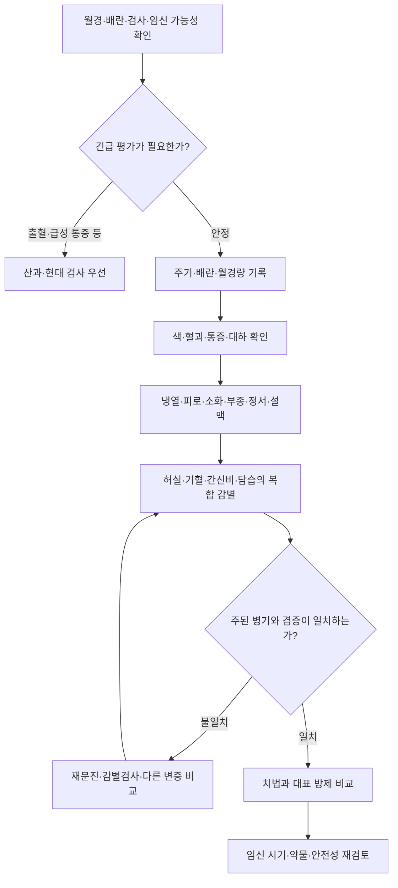

# 여성·난임 처방 선택 네트워크

## 한눈에 보기

처방은 **병기 → 증후 묶음 → 치법 → 방제**로 공부합니다. 아래 구조는 교육용 감별 지도이며 자동 처방기나 자가복용 안내가 아닙니다. [현대 난임 검사](../conditions/infertility-preconception.md#evaluation-timing)와 [초진 문진](../womens-health/fertility-intake.md)을 먼저 확인하고 [설·맥까지 포함한 변증표](../womens-health/fertility-patterns.md#fertility-pattern-table)를 함께 읽습니다.

## 난임 처방 선택을 배우는 순서 {#fertility-formula-network}

| 질문 | 다음에 반드시 함께 볼 자료 | 한 가지 단서로 결정하면 생기는 오류 |
|---|---|---|
| 규칙적인가 / 불규칙한가 | 배란 확인·임신·갑상선·프로락틴·에너지 부족·PCOS | 불규칙 = 신허 또는 담습으로 고정 |
| 정상 배란 / 희발 / 무배란인가 | 검사 방법·약제·주기 길이 | 출혈 한 번 = 배란 회복으로 판단 |
| 과소 / 정상 / 과다인가 | 갑작스러운 변화·빈혈·자궁강·호르몬/피임약 | 과소 = 혈허, 과다 = 열로 단정 |
| 담색 / 선홍 / 암자 / 혈괴인가 | 출혈량·기간·통증·전신 냉열·설맥 | 혈괴 하나만으로 활혈약 선택 |
| 냉증 / 열감 / 피로 / 부종 / 울체 / 건조인가 | 식사·수면·질환·약물과 복합 증후 | 손발 냉증 = 자궁 한랭·난임 원인으로 확정 |

## 병기·치법·방제 비교

| 병기와 증후 묶음 | 전통 치법 | 기존 대표 방제와 감별 |
|---|---|---|
| 혈허: 과소·담색, 어지럼·창백, 담설·세맥 | 양혈조경 | [사물탕](../formulas/siwu-tang.md); 피로·기허도 뚜렷하면 [팔물탕](../formulas/bazhen-tang.md), 수면·심계·식욕저하가 겹치면 [귀비탕](../formulas/guibi-tang.md) |
| 혈허·수습: 하복부 불편, 어지럼·부종·소변 양상 | 양혈·건비이수 | [당귀작약산](../formulas/danggui-shaoyao-san.md); 고정 실통·혈괴가 주된 어혈과 구분 |
| 한허·혈허·어혈이 함께: 냉감·주기 이상·하복부통·건조 등 | 온경산한·양혈거어 | [온경탕](../formulas/wenjing-tang.md); 단순 온열 처방이 아니며 열실증·감염과 구분 |
| 한응어혈: 온열에 완화되는 고정통·암자혈·혈괴 | 온경축어 | [소복축어탕](../formulas/shaofu-zhuyu-tang.md); 출혈·임신 가능성 먼저 확인 |
| 혈어: 고정 압통·암자혈·혈괴, 자설 등 | 활혈화어 | [계지복령환](../formulas/guizhi-fuling-wan.md); 병변의 영상 진단·임신 시기와 별도로 변증 |
| 간울·혈허·비허: 주기성 팽만·유방창통·피로·식욕저하 | 소간양혈·건비 | [소요산](../formulas/xiaoyao-san.md); 열감·번조가 더하면 [가미소요산](../formulas/jiawei-xiaoyao-san.md), 종자문의 간울 맥락은 [개울종옥탕](../formulas/kaiyu-zhongyu-tang.md) |
| 혈허·기체·하초 한이 복합된 조경 맥락 | 조경양혈·이기 | [조경종옥탕](../formulas/tiaojing-zhongyu-tang.md); 난임의 보편 고정 처방 아님 |
| 기혈양허·신허·충임부족의 복합 | 익기양혈·보신조경 | [육린주](../formulas/yulin-zhu.md); 조경종옥탕과 본초·병기 차이를 비교 |
| 신음허·건조·허열, 홍설·세삭맥 | 자음보신 | [육미지황환](../formulas/liu%20wei%20dihuang%20wan.md)·[좌귀환](../formulas/zuogui-wan.md); 수습·소화 허약과 구분 |
| 신양허·냉감·요슬산연·야간뇨, 담반설·침약맥 | 온보신양 | [팔미지황환](../formulas/bawei-dihuang-wan.md)·[우귀환](../formulas/yougui-wan.md); 부자 등 성분·제제 안전성 확인 |
| 기허·중기 부족, 피로·무력·소화저하 | 보기·건비·승양 | [보중익기탕](../formulas/buzhong-yiqi-tang.md); 모든 피로·난임을 승양으로 치료하지 않음 |
| 담습·기체: 몸 무거움·백대·주기 지연·니태 | 조습화담·이기조경 | [이진탕](../formulas/erchen-tang.md) 기본 구조, [창부도담탕](../formulas/cangfu-daotan-tang.md); 비허가 주면 [향사육군자탕](../formulas/xiangsha-liujunzi-tang.md)과 비교 |
| 혈허 겸 열·월경 선기·출혈 양상 | 양혈청열 | [청경사물탕](../formulas/qingjing-siwu-tang.md); 과다출혈의 구조·혈액 원인 먼저 평가 |
| 비허·간울·습, 만성 백대하 | 건비·소간·화습 | [완대탕](../formulas/wandai-tang.md); 감염·임신 관련 분비물 감별 |
| 충임허손·혈허 겸 한·출혈 | 양혈·온경·지혈 | [교애탕](../formulas/jiaoai-tang.md); 절박유산·잔류조직 평가를 대신하지 않음 |
| 남성의 신정 부족 증후 | 보신익정·고섭 | [오자연종환](../formulas/wuzi-yanzong-wan.md); 정액 지표 하나로 선택하지 않음 |

## 월경주기와 처방 시기

[월경기·난포기·배란기·황체기](../womens-health/reproductive-physiology.md#cycle-phases)의 현대 생리는 먼저 이해합니다. 현대 한의 임상에서 월경기 출혈·통증, 난포기 허증, 배란 전후 기혈 소통, 황체기 온양·고섭 등을 논의하지만 모든 주기를 같은 네 처방으로 고정할 근거는 부족합니다. 월경량·기저질환·배란 확인·임신 가능성·호르몬 투약에 따라 계획을 바꿉니다. 활혈 = 월경기 전원, 온양 = 황체기 전원이라는 구조도 피합니다.

## 전통 문헌에서 더 비교할 처방

[《傅青主女科》 종자문](https://jicheng.tw/tcm/book/傅青主女科/index.html)의 양정종옥탕(養精種玉湯), 온포음(溫胞飲), 온토육린탕(溫土毓麟湯), 청골자신탕(清骨滋腎湯), 화수종자탕(化水種子湯)은 각각 허증·한·비신·허열·수습 등의 설명을 비교할 자료입니다. 전통 분류를 현대 PCOS·DOR·난관 폐쇄에 직접 대응시키지 않습니다. [《景岳全書》](../classics/jingyue-quanshu.md)의 보익·종자와 육린주, [《東醫寶鑑》](../classics/donguibogam.md)의 구사·부인, [《方藥合編》](../bangyakhappyeon-network/index.md)의 방제 구조를 함께 읽습니다.

대표 방제의 출전·구성은 개별 문서로 연결하며 이름이 비슷한 처방·탕환 제형·가감방을 같은 제제로 간주하지 않습니다.

## 임신 성립 뒤와 산후

[수태환](../formulas/shoutai-wan.md)·[태산반석산](../formulas/taishan-panshi-san.md)은 전통 안태 맥락이며 임신 전 만능 보약이 아닙니다. [임신 초기](../conditions/pregnancy-herbal-care.md) 출혈·복통은 산과 평가를 우선합니다. [생화탕](../formulas/saenghwa-tang.md)·[불수산](../formulas/bulsu-san.md), [십전대보탕](../formulas/shi-quan-da-bu-tang.md)의 산후 활용도 오로·출혈·감염·수유와 현재 허실을 확인합니다.

## 현대 연구와 안전성

전통 방제의 사용 이력, 특정 제제의 RCT, 여러 가감방을 묶은 메타분석은 서로 다른 근거입니다. ‘보신’이라는 치법이 AMH·난자 질·출산율 상승의 임상 증명이 되지 않습니다. [ART·남성·DOR·유산 근거카드](../authority/conditions/female-infertility-art.md)에서 대상·대조군·생아출산·안전성을 확인합니다. [배란 이후·채취·이식·임신 확인 시 안전성](safety.md#fertility-pregnancy-safety)을 통과해야 실제 치료 계획으로 이어집니다.

[본초 역인덱스](herbs-for-women.md) · [침구 배합](../acupuncture-integrated/points-for-womens-health.md) · [변증](../womens-health/fertility-patterns.md) · [난임 허브](../conditions/infertility-preconception.md)
