# 동씨침법·동씨기혈 부위별 아틀라스 {#tung-atlas}

동씨침법은 **동경창(董景昌, Tung Ching-Chang)의 이름으로 전해지는 침법**으로, 고유한 혈군과 부위별 분류, 아픈 곳에서 떨어진 원위부 선택, 여러 혈을 조합하는 방식 등을 함께 살펴보는 체계입니다. 이 아틀라스에서는 **손가락·손·아래팔·위팔·발등·종아리·허벅지의 주요 50혈**을 위치 그림에서 찾아볼 수 있습니다.

영골·대백이 궁금하면 **손등**, 중자·중선은 **손바닥**, 하삼황은 **종아리 안쪽**, 사마혈은 **허벅지**를 고르세요. 그림의 점을 누르면 해당 혈의 위치, 대표 주치, 효능·활용 방향과 임상 평가로 이어집니다. 50개 위치점 모두에 주치 출처를 연결했으며, 토수·삼중·사마처럼 공동 주치를 쓰는 혈군은 그 관계를 명시했습니다.

## 부위 그림으로 찾기 {#regions}

- [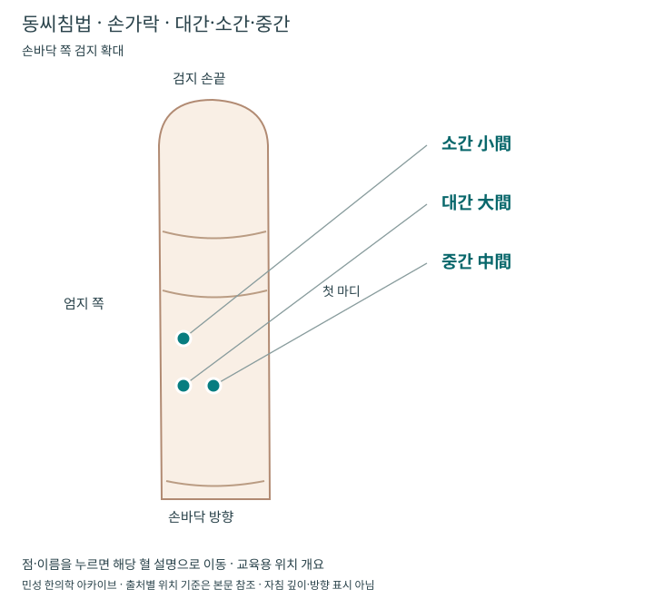{ loading=lazy }](fingers.md)

    **[11 부위 · 손가락 · 대간·소간·중간·측간](fingers.md)**

- [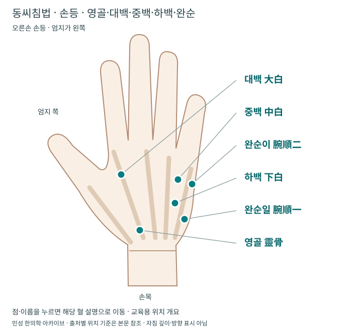{ loading=lazy }](hand-dorsal.md)

    **[22 부위 · 손등 · 영골·대백·중백·하백·완순](hand-dorsal.md)**

- [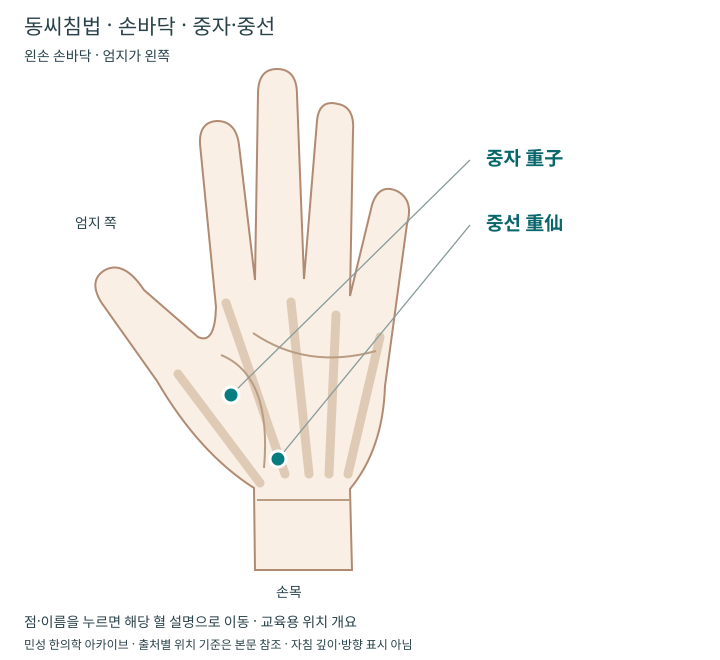{ loading=lazy }](hand-palmar.md)

    **[22 부위 · 손바닥 · 중자·중선·토수](hand-palmar.md)**

- [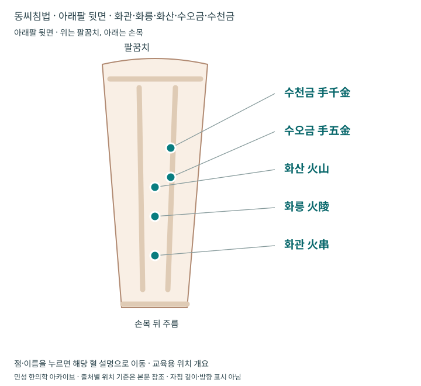{ loading=lazy }](forearm.md)

    **[33 부위 · 아래팔 뒷면 · 화관·화릉·화산·수오금·수천금](forearm.md)**

- [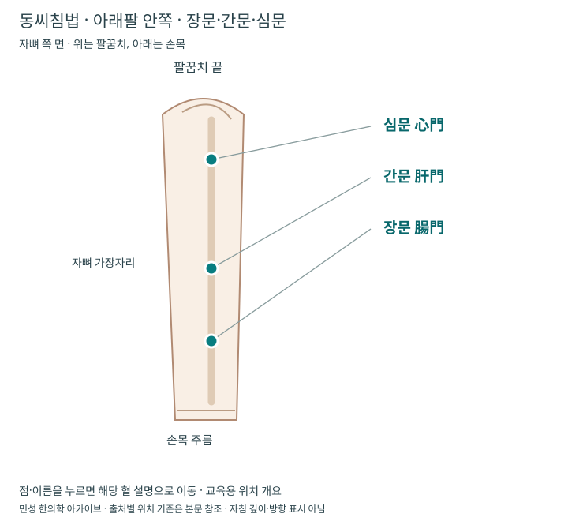{ loading=lazy }](forearm-ulnar.md)

    **[33 부위 · 아래팔 안쪽 · 장문·간문·심문](forearm-ulnar.md)**

- [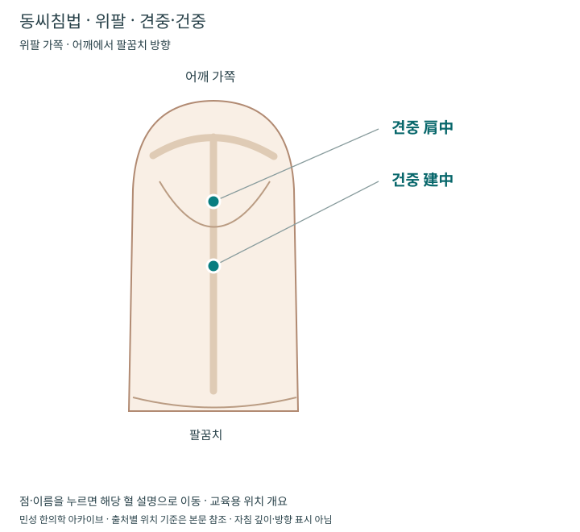{ loading=lazy }](upper-arm.md)

    **[44 부위 · 위팔 · 견중·건중](upper-arm.md)**

- [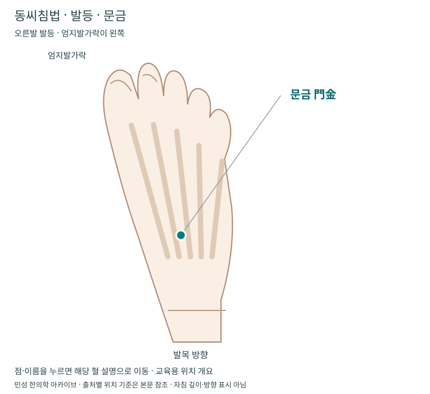{ loading=lazy }](foot.md)

    **[66 부위 · 발등 · 문금·화경·화주·목두·목류·수곡](foot.md)**

- [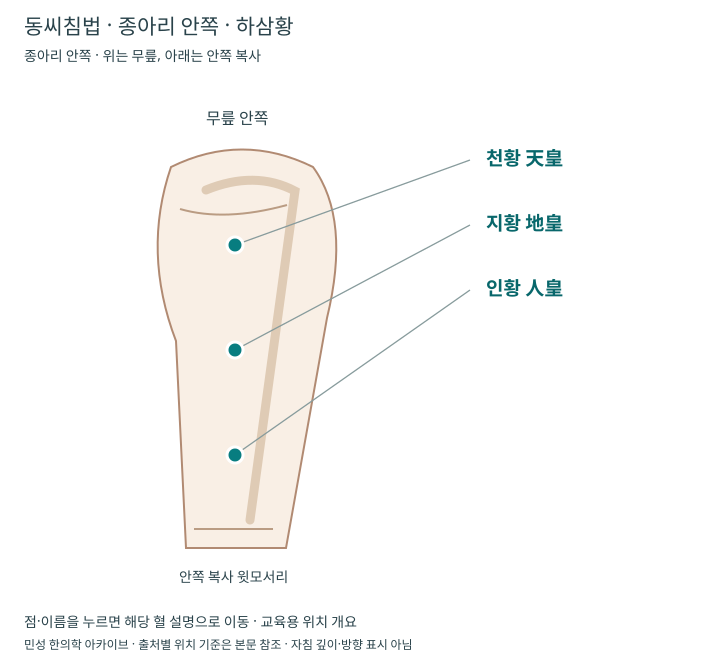{ loading=lazy }](lower-leg.md)

    **[77 부위 · 종아리 안쪽 · 하삼황](lower-leg.md)**

- [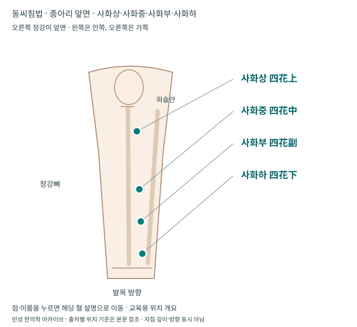{ loading=lazy }](lower-leg-front.md)

    **[77 부위 · 종아리 앞면 · 사화상·사화중·사화부·사화하](lower-leg-front.md)**

- [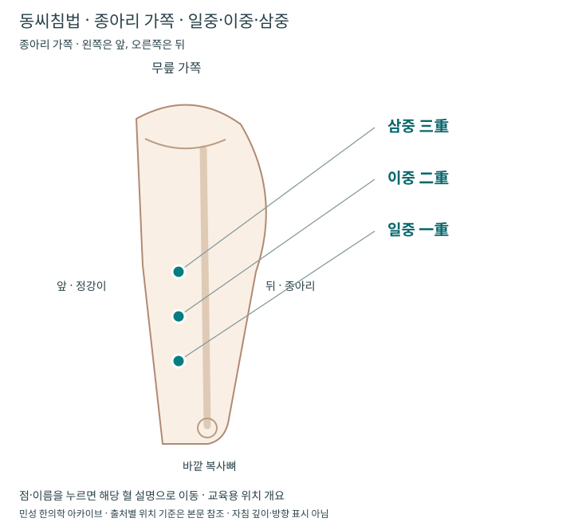{ loading=lazy }](lower-leg-lateral.md)

    **[77 부위 · 종아리 가쪽 · 일중·이중·삼중](lower-leg-lateral.md)**

- [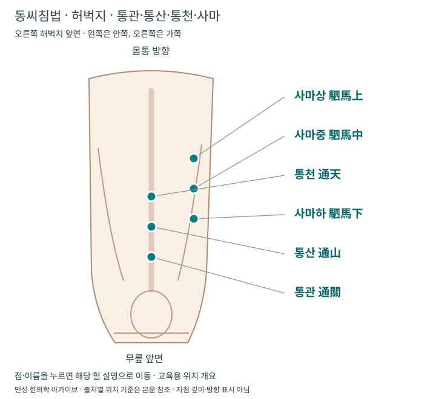{ loading=lazy }](thigh.md)

    **[88 부위 · 허벅지 · 통관·통산·통천·사마](thigh.md)**

- [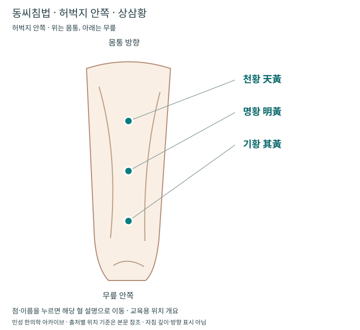{ loading=lazy }](thigh-medial.md)

    **[88 부위 · 허벅지 안쪽 · 상삼황](thigh-medial.md)**

같은 면에서 읽는 혈들을 한 문서에 묶고, 아래팔·종아리·허벅지는 보는 면을 나누었습니다. 토수 세 점을 각각 포함해 총 50개의 위치점을 수록했습니다. 개별 혈 이름으로도 검색할 수 있고, 큰 도해에서 해당 혈로 이동할 수 있습니다.

## 처음 읽는 분을 위한 분류 {#zones}

동씨기혈의 부위 번호는 경맥 번호가 아닙니다. 22는 손 부위, 77은 종아리 부위를 뜻합니다. 영문 자료에서 `T`를 붙인 번호를 쓰기도 하지만 전승별로 추가 혈이나 명칭·위치 기술이 달라, 이 아틀라스는 **한글·한자 이름과 출처**를 함께 표시합니다.

| 부위 분류 | 몸에서 찾을 곳 | 이 아틀라스의 연결 |
|---|---|---|
| 11 | 손가락 | [대간·소간·중간·측간](fingers.md) |
| 22 | 손 | [손등·완순](hand-dorsal.md), [손바닥·토수](hand-palmar.md) |
| 33 | 아래팔 | [화관·수오금·수천금](forearm.md), [장문·간문·심문](forearm-ulnar.md) |
| 44 | 위팔 | [견중·건중](upper-arm.md) |
| 55·66 | 발가락·발바닥·발등 — 세부 구분은 자료에 따라 확인 | [문금·화경·화주·목두·목류·수곡](foot.md) |
| 77 | 종아리 | [안쪽 하삼황](lower-leg.md), [앞면 사화](lower-leg-front.md), [가쪽 삼중](lower-leg-lateral.md) |
| 88 | 허벅지 | [앞면·사마혈](thigh.md), [안쪽 상삼황](thigh-medial.md) |
| 99·1010 | 귀·머리·얼굴 | 이번 도해 수록 범위 밖이며, [참고 자료의 부위별 목록](https://www.tungs-acupuncture.com/董氏穴位詳解/)에서 확인 |

현재는 주요 50혈을 수록한 아틀라스이며 동씨기혈 전체 목록이나 전수 도해는 아닙니다. 몸통의 전후면 등을 별도 분류하는 자료도 있습니다.

## 위치를 정확히 읽는 기준 {#location-basis}

**체표 위치 → 사용하는 면과 자세 → 기준 뼈·주름 → 출처의 거리 표현** 순서로 읽습니다. 손가락은 손등·손바닥을, 손과 발에서는 손끝·발끝 방향과 몸쪽 방향을 먼저 구별합니다. 촌·분은 해당 자료의 신체 비례와 촉지 기준에 따른 표현이므로 화면 길이를 그대로 cm나 mm로 환산하지 않습니다.

이 도해는 [董氏心氣神針의 공개 혈위 설명](https://www.tungs-acupuncture.com/董氏穴位詳解/)을 위치 확인 자료로 삼아 아카이브에서 직접 그린 교육용 개요입니다. 원본 그림과 본문을 복제하지 않았으며, 천황·화관처럼 **위치 기술이 다른 경우에는 해당 문서에 기준을 명시**했습니다. 손가락 첫 마디·천황·완순의 다른 기술은 eLotus 자료도 대조했습니다. 토수와 사화부는 각 본문에 표시한 eLotus 위치 기준을 사용합니다.

WHO 361경혈은 [표준 경혈 아틀라스](../acupoint-network/standard-atlas.md), 십이경맥의 몸에서 지나가는 길은 [경락·경맥 지식망](../meridian-network/index.md)에서 이어서 봅니다. 동씨기혈이 표준경혈과 가까이 있거나 같은 이름을 쓰더라도 **이름만으로 같은 점이라고 판정하지 않습니다**.

| 혼동하기 쉬운 이름 | 확인할 차이 |
|---|---|
| 영골·대백과 합곡 | 같은 엄지·검지 사이 영역이라도 위치 기준을 각각 확인 |
| 중백·하백과 중저·액문 | 넷째·다섯째 손허리뼈 사이에서 손끝·손목 방향과 거리를 구별 |
| 동씨 견중과 견중수 SI15 | 위팔 가쪽과 등 위쪽의 서로 다른 부위 |
| 동씨 통천과 통천 BL7 | 허벅지와 머리의 서로 다른 부위 |
| 허벅지 천황 天黃과 종아리 천황 天皇 | [상삼황](thigh-medial.md)과 [하삼황](lower-leg.md)의 서로 다른 부위·한자 |
| 완순일·완순이 | [출처별 이름과 손목 거리](hand-dorsal.md#wanshun-variants)를 함께 확인 |
| 천황과 천황부 | 전승·숫자 코드·음릉천과의 관계를 함께 확인 |

## 배혈과 동기요법은 어떻게 읽나요? {#principles}

**원위 취혈**은 아픈 부위와 떨어진 손·발·팔다리의 혈군을 고르는 방식입니다. 예를 들어 손등의 영골·대백을 요배부·하지 통증과 연결하는 전승의 설명을 읽을 수 있습니다. 이때 증상 부위의 근육·관절·신경 평가와 어떤 동작이 불편한지를 함께 기록해야 배혈의 목적이 분명해집니다.

**도마(倒馬)**는 같은 영역의 관련 혈을 묶어 사용하는 배혈 방식으로 소개됩니다. 점의 숫자를 늘리는 것이 목적이 아니라, 선택한 혈군과 치료 목표의 관계를 읽는 데 의미가 있습니다. [기존 배혈 원리](../meridian-network/special-points/index.md)와 연결하되 서로 다른 체계의 진단 논리를 무리하게 합치지 않습니다.

**동기요법(動氣療法)**은 전승에서 원위부 자극과 증상 부위의 움직임을 연결하여 반응을 확인하는 방법으로 설명됩니다. 임상에서는 치료 전후에 같은 동작의 통증과 범위를 비교하는 관점이 유용합니다. 다만 유침 중 움직임은 침 위치와 위험을 고려해 시술자가 관리하는 영역이며, 침이 놓인 팔·다리를 스스로 움직이거나 집에서 따라 하는 안내가 아닙니다.

이 원리들은 [중자·중선의 견갑부 연결](hand-palmar.md#clinical), [견중·건중의 무릎 연결](upper-arm.md#clinical)과 함께 읽으면 이해하기 쉽습니다. 전승 설명은 [중자·중선 자료](https://www.tungs-acupuncture.com/重子穴/)와 [견중·건중 자료](https://www.tungs-acupuncture.com/肩中穴、建中穴/)에 제시되어 있습니다.

## 현대 임상과 연구로 연결 {#evidence}

| 살펴볼 주제 | 동씨 혈군을 읽는 출발점 | 함께 확인할 기존 자료 |
|---|---|---|
| 허리·하지 통증 | [영골·대백·완순](hand-dorsal.md), [수오금·수천금](forearm.md) | [요통](../conditions/low-back-pain.md), [좌골신경통 근거](../authority/conditions/sciatica.md) |
| 어깨·견갑부 | [중자·중선](hand-palmar.md) | [어깨통증](../conditions/shoulder-pain.md), [임상해부학](../clinical-anatomy/index.md) |
| 무릎·보행 | [견중·건중](upper-arm.md), [통관·통산·통천](thigh.md) | [무릎통증](../conditions/knee-pain.md), [무릎 골관절염 근거](../authority/conditions/knee-osteoarthritis.md) |
| 월경 관련 복통·소화 불편 | [문금·목두·목류](foot.md), [토수](hand-palmar.md), [사화혈](lower-leg-front.md) | [월경통 근거](../authority/conditions/primary-dysmenorrhea.md) |
| 피로·눈의 불편 | [상삼황](thigh-medial.md) | [피로·원기회복](../conditions/energy-recovery.md) |
| 비염·피부 불편 | [사마혈](thigh.md) | [알레르기비염 근거](../authority/conditions/allergic-rhinitis.md) |

표의 연결은 전승의 활용 맥락과 현재의 임상 질문을 함께 찾는 길입니다. 링크된 일반 침 연구가 해당 동씨 혈군의 효과를 직접 검증한 연구라는 뜻은 아닙니다. **동씨침과 일반 경혈침을 직접 비교한 고령자 만성요통 무작위시험**은 [기존 침구 근거 문서](../acupuncture-integrated/evidence.md#tung-study)에 대상·비교군·결과를 정리했습니다.

원위 배혈 체계를 함께 공부할 때는 [사암침법](../acupuncture-specific/saam-acupuncture.md)의 정격·승격과 동씨 혈군의 구성·위치 기준을 구분합니다. [태극침법](../taegeuk-acupuncture/index.md#comparison)의 체질별 세 혈 구성도 함께 비교할 수 있습니다. 병행 치료의 기록과 재평가는 [임상 선택 문서](../acupuncture-specific/saam-clinical-selection.md#integration)에서 이어집니다.

## 시술 전·후 확인할 것 {#safety}

손·발의 작은 영역에도 신경·혈관·힘줄이 있으므로 위치 그림만으로 자침 깊이나 방향을 정하지 않습니다. 출혈 경향·항응고제, 임신, 감각 저하, 피부 감염·상처·부종과 이전 시술 반응을 확인합니다. 깊은 자침·투자·사혈은 이 도해에 포함하지 않습니다.

치료 후에는 통증 강도뿐 아니라 **같은 동작의 범위·걷기·일상 기능·수면·약물 사용과 이상반응**을 기록합니다. [침구치료 경과·재평가](../acupuncture-integrated/followup.md)와 [안전·위험신호](../acupuncture-integrated/safety.md)를 함께 확인하세요.
